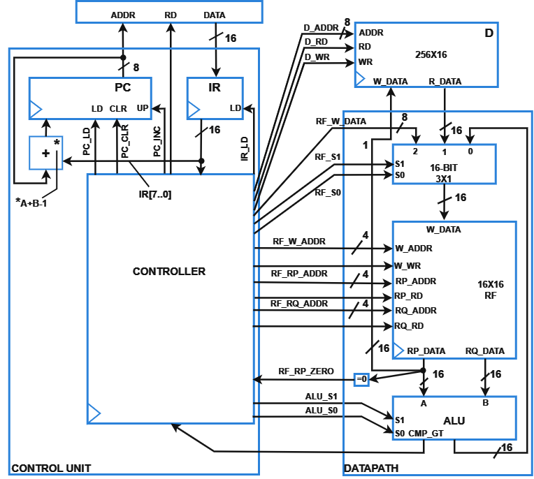
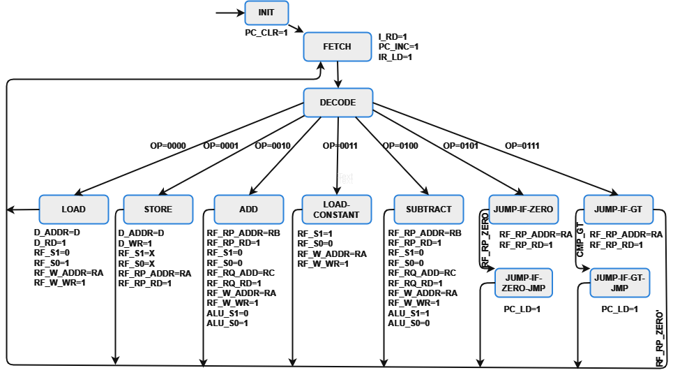

# Digital processor

Using VHDL program language, this project specifies the behavior of a seven instructions digital processor, listed bellow:

|   Instruction   |              Meaning           | opcode |
| ----------------| -------------------------------| ------ |
| MOV Ra, d       | RF[a] = D[d]                   |  0000  |
| MOV d, RA       | D[d] = RF[a]                   |  0001  |
| ADD Ra, Rb, Rc  | RF[a] = RF[b] + RF[c]          |  0010  |
| MOV Ra, #C      | RF[a] = c                      |  0011  |
| SUB Ra, Rb, Rc  | RF[a] = RF[b] - RF[c]          |  0100  |
| JMPZ Ra, offset | PC = PC + offset if RF[a] = 0  |  0101  |
| JGT Ra, Rb, Rc  | PC = RF[C] if RF[a] > RF[b]    |  0111  |

Using RTL design, the digital processor should work as follows

In the image above, the Datapath will operate the datas stored in RAM, while the Control Unit will control the Datapath following the instructions from the instruction memory.

Finally, the High State Level Machine of the processor should work as follows

# Note

This project was made by undergraduate students of Computer Engineering for the class of Digital Systems, at Universidade Federal do Rio Grande do Norte (UFRN). All the project was based on the book from Frank Vahid (VAHID, Frank. Digital design with RTL design, VHDL, and Verilog. John Wiley & Sons, 2010).